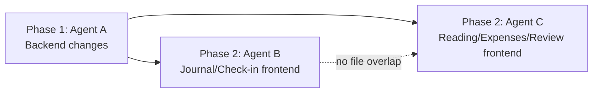

# Mindful Life App — Improvement Plan & 3-Agent Work Division

## Overview

8 improvement items divided across 3 agents so they can work in **parallel without file conflicts**. The key constraint is that `app.js` (3024 lines), `index.html` (1177 lines), and `style.css` are single monolithic files — so **only one agent can touch each file at a time**.

---

## Architecture Quick Reference

| Layer | Key Files |
|-------|-----------|
| **Frontend** | `frontend/app.js` (159KB), `frontend/index.html` (64KB), `frontend/style.css` (31KB) |
| **Backend API** | `backend/main.py` (679 lines — routes) |
| **Backend Services** | `backend/services/review_agent.py`, `firestore_service.py`, etc. |
| **Data Models** | `backend/models/schemas.py` |

---

## Work Division Strategy

Since the 3 main frontend files (`app.js`, `index.html`, `style.css`) are monolithic, we **split by execution phase** rather than by file:

| Phase | Agent | Focus | Files Touched |
|-------|-------|-------|---------------|
| **Phase 1** | **Agent A** | Backend-only changes | `main.py`, `schemas.py`, `firestore_service.py`, `review_agent.py` |
| **Phase 2** | **Agent B** + **Agent C** | Frontend changes (split by page/section) | `index.html`, `app.js`, `style.css` — divided by section |

**Phase 1 runs first** (Agent A alone), then **Phase 2** runs with Agents B & C working on different *sections* of the frontend files.

> [!IMPORTANT]
> Agents B and C work on completely different HTML pages/sections and JS function blocks to avoid merge conflicts. The exact line-range ownership is specified below.

---

## Agent A — Backend & Data Layer (Phase 1)

**Runs first, independently. No frontend files touched.**

### Feature 1: Make All Entries Editable (Backend)
Currently editable: books, runs, work, expenses, social. **Missing**: check-ins, journals, gratitude.

#### [MODIFY] [main.py](file:///Users/chautran/Documents/projects/_mindful-life-03.2026/growth-track/backend/main.py)
- Add `PUT /api/checkins/{checkin_id}` route (follow the `update_run` pattern on lines 106–117)
- Add `DELETE /api/checkins/{checkin_id}` route
- Add `PUT /api/journal/{journal_id}` route
- Add `DELETE /api/journal/{journal_id}` route
- Add `PUT /api/gratitude/{gratitude_id}` route
- Add `DELETE /api/gratitude/{gratitude_id}` route

#### [MODIFY] [firestore_service.py](file:///Users/chautran/Documents/projects/_mindful-life-03.2026/growth-track/backend/services/firestore_service.py)
- Ensure `save_document` with `doc_id` supports update-in-place (verify existing behavior covers this)

### Feature 2: Expense Dual Currency (Backend)
Currently expenses store `amount`, `currency`, and `amount_usd`. Need to also store/return `amount_vnd`.

#### [MODIFY] [main.py](file:///Users/chautran/Documents/projects/_mindful-life-03.2026/growth-track/backend/main.py)
- In `add_expense()` (line 486–500): compute and store `amount_vnd` alongside `amount_usd` using the existing exchange rate table
- In `get_expenses()`: ensure response includes both `amount_usd` and `amount_vnd` fields
- In `update_expense()`: recalculate both conversions on update

#### [MODIFY] [schemas.py](file:///Users/chautran/Documents/projects/_mindful-life-03.2026/growth-track/backend/models/schemas.py)
- Add `amount_vnd: Optional[float]` field to `TravelExpense` model (line ~201)

### Feature 3: Reading Progress & Notes (Backend)
Currently `BookEntry` has `pages` but no reading progress log or per-book notes.

#### [MODIFY] [schemas.py](file:///Users/chautran/Documents/projects/_mindful-life-03.2026/growth-track/backend/models/schemas.py)
- Add `pages_read: Optional[int] = 0` field to `BookEntry` (current progress)
- Add new `BookNote` model: `{ book_id, date, content, pages_at_time }`  
- Add new `ReadingProgress` model: `{ book_id, date, pages_read }`

#### [MODIFY] [main.py](file:///Users/chautran/Documents/projects/_mindful-life-03.2026/growth-track/backend/main.py)
- Add `POST /api/books/{book_id}/progress` — log pages read on a date
- Add `GET /api/books/{book_id}/progress` — get reading progress entries
- Add `POST /api/books/{book_id}/notes` — add a note to a book
- Add `GET /api/books/{book_id}/notes` — get notes for a book
- Update `get_books` to include total pages read in response

### Feature 4: Review Checklists (Backend)

#### [MODIFY] [review_agent.py](file:///Users/chautran/Documents/projects/_mindful-life-03.2026/growth-track/backend/services/review_agent.py)
- Add checklist generation function that returns structured checklists per period (weekly/monthly/quarterly)
- Checklists organized by 5 categories: **Body, Mind, Spirit, Social, Financial** (exclude emotional/sexual identity items)
- Weekly checklist items example: exercise consistency, sleep quality, meditation streak, reading progress, budget check, social connections, deep work hours, journal consistency
- Monthly/quarterly add: goal review, habit assessment, financial summary, relationship nurturing, spiritual practice evaluation

#### [MODIFY] [main.py](file:///Users/chautran/Documents/projects/_mindful-life-03.2026/growth-track/backend/main.py)
- Add `GET /api/reviews/checklist?period=weekly&date=2026-03-01` — returns checklist template
- Add `POST /api/reviews/checklist` — save completed checklist
- Add `GET /api/reviews/checklists?period=weekly` — list saved checklists

#### [MODIFY] [schemas.py](file:///Users/chautran/Documents/projects/_mindful-life-03.2026/growth-track/backend/models/schemas.py)
- Add `ReviewChecklist` model with fields: `period`, `start_date`, `end_date`, `categories` (dict of category→items), `completed_items` (list), `notes`

### Feature 5: Daily Check-In Enhancements (Backend)
Morning planning + night evaluation structure.

#### [MODIFY] [schemas.py](file:///Users/chautran/Documents/projects/_mindful-life-03.2026/growth-track/backend/models/schemas.py)
- Add to `DailyCheckIn`: `morning_activities: Optional[list[dict]] = None` (each: `{time, activity, completed}`)  
- Add `intention: Optional[str] = None`

#### [MODIFY] [main.py](file:///Users/chautran/Documents/projects/_mindful-life-03.2026/growth-track/backend/main.py)
- Update `create_checkin` to accept the new fields
- The night check-in (existing form) now evaluates morning planned activities

---

## Agent B — Frontend: Journal & Check-In Pages (Phase 2)

**Owns**: Journal page section in `index.html` (lines ~423–617), journal/check-in JS functions in `app.js`, and related CSS.

### Feature 6: Journal UI Fixes

#### [MODIFY] [style.css](file:///Users/chautran/Documents/projects/_mindful-life-03.2026/growth-track/frontend/style.css)
- Fix `.journal-col-entry` positioning — the "Write Entry" card currently overlaps "Recent Journals" on scroll. Change from `position: sticky` to normal flow, or add proper `z-index` + `top` constraints

#### [MODIFY] [index.html](file:///Users/chautran/Documents/projects/_mindful-life-03.2026/growth-track/frontend/index.html)
- **Scope: lines 423–617 only** (Journal page section)
- Ensure journal entry card has proper layout containment

#### [MODIFY] [app.js](file:///Users/chautran/Documents/projects/_mindful-life-03.2026/growth-track/frontend/app.js)
- **Scope: `loadJournalHistory` function (lines 1753–1791) and journal form handler (lines 1720–1752)**
- In `loadJournalHistory`: Change truncation from hard 200-char cut to a "...see more" expandable pattern. Add `onclick` handler that toggles full content visibility

### Feature 7: Make Entries Editable (Frontend — Journal, Gratitude, Check-In)
Wire up the new backend edit/delete endpoints from Agent A.

#### [MODIFY] [app.js](file:///Users/chautran/Documents/projects/_mindful-life-03.2026/growth-track/frontend/app.js)
- **Scope: lines 505–577 (check-in section) and lines 1720–1842 (journal + gratitude section)**
- Add edit button rendering in `loadCheckinHistory` (line 547–577), following the pattern from `loadRunHistory`
- Add `openCheckinEdit()` / `cancelCheckinEdit()` functions (pattern: copy from `openRunEdit`)
- Add edit button rendering in `loadJournalHistory` (line 1753–1791)
- Add `openJournalEdit()` / `cancelJournalEdit()` functions  
- Add edit/delete to `loadGratitudeHistory` (line 1816–1842)

#### [MODIFY] [index.html](file:///Users/chautran/Documents/projects/_mindful-life-03.2026/growth-track/frontend/index.html)
- **Scope: lines 97–179 (check-in page)**
- Add `<input type="hidden" id="checkin-edit-id">` to check-in form
- Add cancel/delete buttons to check-in form (following run form pattern)

### Feature 8: Daily Check-In Enhancements (Frontend)
Morning planning + night check-in + show notes in history.

#### [MODIFY] [index.html](file:///Users/chautran/Documents/projects/_mindful-life-03.2026/growth-track/frontend/index.html)
- **Scope: lines 97–179 (check-in page)**
- Add "Morning Planning" section above current form: time-slot based activity planner with intention field
- Restructure current form as "Evening Check-In" with activity evaluation checkboxes

#### [MODIFY] [app.js](file:///Users/chautran/Documents/projects/_mindful-life-03.2026/growth-track/frontend/app.js)
- **Scope: lines 505–577 (check-in section)**
- Add morning planning submit handler
- Update `loadCheckinHistory` to show notes field in each history item
- Add morning activity evaluation rendering in the evening form

---

## Agent C — Frontend: Reading, Expenses & Review Pages (Phase 2)

**Owns**: Reading page, Expenses page, and Review page sections. No overlap with Agent B's journal/check-in scope.

### Feature 9: Expense Dual Currency (Frontend)

#### [MODIFY] [app.js](file:///Users/chautran/Documents/projects/_mindful-life-03.2026/growth-track/frontend/app.js)
- **Scope: `loadExpenses` function (lines 2151–2239) and expense form handler (lines 2110–2150)**
- In `loadExpenses` summary section: show both USD total and VND total (with `K` suffix for thousands)
- In expense history items: show both currencies
- In calendar rendering for expenses: show VND amount with `K` unit only

#### [MODIFY] [index.html](file:///Users/chautran/Documents/projects/_mindful-life-03.2026/growth-track/frontend/index.html)
- **Scope: Travel/Expense page section** (lines ~910–1020)
- Update summary card layout to accommodate dual currency display

### Feature 10: Reading Progress & Notes (Frontend)

#### [MODIFY] [app.js](file:///Users/chautran/Documents/projects/_mindful-life-03.2026/growth-track/frontend/app.js)
- **Scope: lines 808–1160 (Reading section)**
- In `loadBooks`: add pages-read progress indicator on each book card
- Add "Log Pages" quick-action on book cards
- When clicking a book card: show a detail/preview panel with notes list
- Add reading progress logging form/modal
- Update calendar data to show pages read per day

#### [MODIFY] [index.html](file:///Users/chautran/Documents/projects/_mindful-life-03.2026/growth-track/frontend/index.html)
- **Scope: Reading page section** (lines ~288–420)
- Add a book detail/preview modal or expandable panel
- Add "Log Pages Read" quick form

### Feature 11: Review Checklists (Frontend)

#### [MODIFY] [app.js](file:///Users/chautran/Documents/projects/_mindful-life-03.2026/growth-track/frontend/app.js)
- **Scope: lines 1842–2049 (Review section)**
- Add checklist sub-cards within the review page — one per period (weekly/monthly/quarterly)
- Each sub-card shows a clickable list of past checklists for that period
- Clicking opens the checklist with checkboxes organized by category (Body, Mind, Spirit, Social, Financial)
- Save/update checklist progress

#### [MODIFY] [index.html](file:///Users/chautran/Documents/projects/_mindful-life-03.2026/growth-track/frontend/index.html)
- **Scope: Review page section** (lines ~619–793)
- Add checklist sub-cards area within the review page
- Add checklist modal/overlay HTML structure

---

## Proposed: Strava Integration Improvements (For Another Agent)

> [!IMPORTANT]
> These are **new requirements** added during implementation. Assign to a separate agent or handle after Phase 2.

### Strava UI/UX Overhaul

#### [MODIFY] [index.html](file:///Users/chautran/Documents/projects/_mindful-life-03.2026/growth-track/frontend/index.html)
**Scope: Running page section (lines ~182–285)**
1. **Minimal connected state**: Replace the large Strava connection card with a slim bar at the top of the Running tab:
   - When connected: thin pill showing `✅ Connected to Strava` + link `See Strava Profile →`
   - When disconnected: compact `Connect Strava` button (not the current large card)
2. **Move Strava sync to top**: The sync/connect card should be the first element in the Running tab

#### [MODIFY] [app.js](file:///Users/chautran/Documents/projects/_mindful-life-03.2026/growth-track/frontend/app.js)
**Scope: Strava/Run calendar sections**
1. **Persistent Strava login**: Store token with 7-day expiry in `localStorage`. On load, check if token exists and is valid — if so, auto-fetch runs without re-prompting
2. **Color-coded run calendar**: Update `renderCalendar` to color-code runs by type:
   - Easy → green, Tempo → orange, Interval → red, Long → blue, Recovery → gray, Race → gold
3. **Strava runs card**: After connecting, fetch and display Strava runs in a dedicated card:
   - Show all runs from the most recent month by default
   - Add a "See more runs" dropdown/button to load older runs
   - Runs should persist on page refresh (cache in `localStorage` alongside token)
4. **Calendar sync**: When Strava runs are fetched, merge them into the run calendar view

#### [MODIFY] [style.css](file:///Users/chautran/Documents/projects/_mindful-life-03.2026/growth-track/frontend/style.css)
- Add `.strava-connected-bar` slim pill styles
- Add run-type color classes for calendar bubbles

> [!NOTE]
> Running tab already has full edit support (`openRunEdit`/`cancelRunEdit`). No edit work needed there.

---

## File Ownership Summary (Conflict Prevention)

| File | Agent A | Agent B | Agent C |
|------|---------|---------|---------|
| `main.py` | ✅ All routes | ❌ | ❌ |
| `schemas.py` | ✅ All models | ❌ | ❌ |
| `review_agent.py` | ✅ | ❌ | ❌ |
| `firestore_service.py` | ✅ (verify only) | ❌ | ❌ |
| `index.html` | ❌ | ✅ Lines 97–617 (Check-in + Journal) | ✅ Lines 288–420, 619–793, 910–1020 (Reading + Review + Expenses) |
| `app.js` | ❌ | ✅ Lines 505–577, 1720–1842 (Check-in + Journal + Gratitude) | ✅ Lines 808–1160, 1842–2239 (Reading + Review + Expenses) |
| `style.css` | ❌ | ✅ Journal layout fixes | ✅ New styles for checklists, book detail panel |

> [!WARNING]
> **Agents B and C must NOT edit overlapping line ranges.** If both need new CSS, Agent B should add at the **top** of `style.css` (after existing rules) and Agent C at the **bottom**.

---

## Execution Order

1. **Agent A goes first** — all backend routes, models, and service changes
2. **Agents B & C run in parallel** — they own non-overlapping sections of the frontend files

---

## Verification Plan

### Manual Testing (by you after each phase)
1. **After Agent A**: Run the backend (`venv/bin/python main.py`) and test new API endpoints via browser console or curl:
   - `PUT /api/checkins/{id}`, `DELETE /api/checkins/{id}`
   - `PUT /api/journal/{id}`, `DELETE /api/journal/{id}`
   - `POST /api/books/{id}/progress`, `GET /api/books/{id}/notes`
   - `GET /api/reviews/checklist?period=weekly`

2. **After Agents B & C**: Open `http://localhost:8080` and verify:
   - All tabs have edit buttons on history entries
   - Journal "...see more" expansion works
   - Journal "Write Entry" card no longer overlaps recent journals
   - Check-in history shows notes
   - Morning planning form appears on check-in page
   - Expenses show both USD and VND amounts
   - Reading page shows pages progress and book notes
   - Review page has clickable checklist sub-cards

---

## User Review Required

> [!IMPORTANT]
> **Review checklist PDF**: You mentioned a PDF with weekly/monthly/quarterly review templates. I couldn't find a PDF in the project directory. Could you either:
> 1. Share the PDF or paste the checklist items you'd like per category (Body, Mind, Spirit, Social, Financial), or
> 2. Confirm that I should generate reasonable defaults based on what the app already tracks?

> [!NOTE]
> The "emotional/sexual identity" exclusion from the checklist is noted and will be respected.

---

## Phase 4: Agent E Tasks (Data Retrieval & Journal Prompts)

### Feature 12: Fixing Old Firebase Data Retrieval
User reported missing previously created entries for books, journals, etc.
#### [MODIFY] Backend routes and queries
- Investigate schema / collection name mismatches (e.g., `journal` vs `journals`).
- Ensure backend query dates or formats perfectly align with what's actually stored in Firebase so old entries render properly.

### Feature 13: Journal Prompt Formatting & Tab UI
#### [MODIFY] [index.html](file:///Users/chautran/Documents/projects/_mindful-life-03.2026/growth-track/frontend/index.html)
- Rearrange the prompt filter chips/tabs into exactly this order: **Random - Gratitude - AI - All**.
#### [MODIFY] [style.css](file:///Users/chautran/Documents/projects/_mindful-life-03.2026/growth-track/frontend/style.css)
- Reduce the font size of the Journal Prompt text to 12-13px so that it is less dominant on the screen.

### Feature 14: AI Prompt Engineering Update
#### [MODIFY] [journal_agent.py](file:///Users/chautran/Documents/projects/_mindful-life-03.2026/growth-track/backend/services/journal_agent.py)
- **Less specific recent context**: Dial back exact references to mundane activities (e.g., "Bach Hoa Xanh") so it feels less creepy/autogenerated.
- **Stoicism / Plum Village blend**: Adapt the tone to incorporate mindfulness teachings from Stoicism or Plum Village.
- **Thematic connection**: Tie the prompt to Body, Mind, and Spirit themes, and the user's monthly checklist.

---

## Phase 5: Agent F Tasks (UI Polish & Morning Planning)

### Feature 15: UI Polish & Strava Refinement
- **Expense Log**: Fixed entry titles showing "undefined" by correctly mapping them to the `description` field in `app.js`.
- **Strava Block**: Fixed desktop layout where the connection bar stretched vertically by applying the `span-all` grid class in `index.html`.
- **Strava Styling**: Removed Strava-specific orange accents/borders; updated the connection bar and list card to use the app's dark green accent and dark-mode compliant backgrounds.

### Feature 16: Morning Planning Persistence & Checklist
- **Date-Based Loading**: Added backend and frontend logic to load specific morning plans based on the selected date in the check-in form.
- **Checklist UI**: Added checkboxes to planned activities in `app.js` with strike-through styling on completion.
- **Smart Auto-Save**: Implemented auto-saving for intention and activities that merges with existing daily metrics (sleep, steps) rather than overwriting them.

